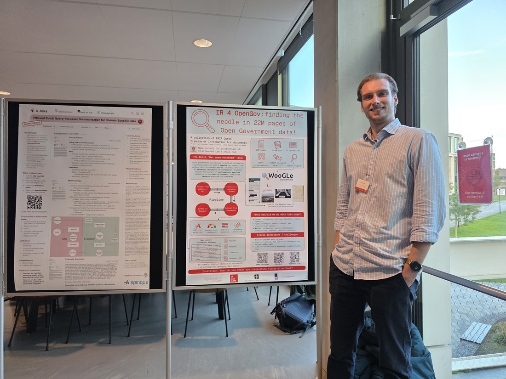

# Presenting my poster at DIR2025!

On Monday, October 27, the annual Dutch-Belgian Information Retrieval (DIR) conference took place at Radboud University Nijmegen. This conference brings together researchers from Dutch and Belgian institutions to discuss Information Retrieval. It is intended as a showcase of research that has already been published in journals or conferences.

Take a look at my poster [here](/pdf/dir2025-poster.pdf)!

Since I have been working for several years on [WooGLe](https://woogle.wooverheid.nl), a search engine for government information, and the accompanying dataset of government documents, about which we published an [article this year in Nature Scientific Data](https://www.nature.com/articles/s41597-025-05052-2), I was invited to present (an updated version of) this research in the form of a poster. Extra special: this was the first presentation I’ve given at a conference since the start of my PhD research in September 2025!