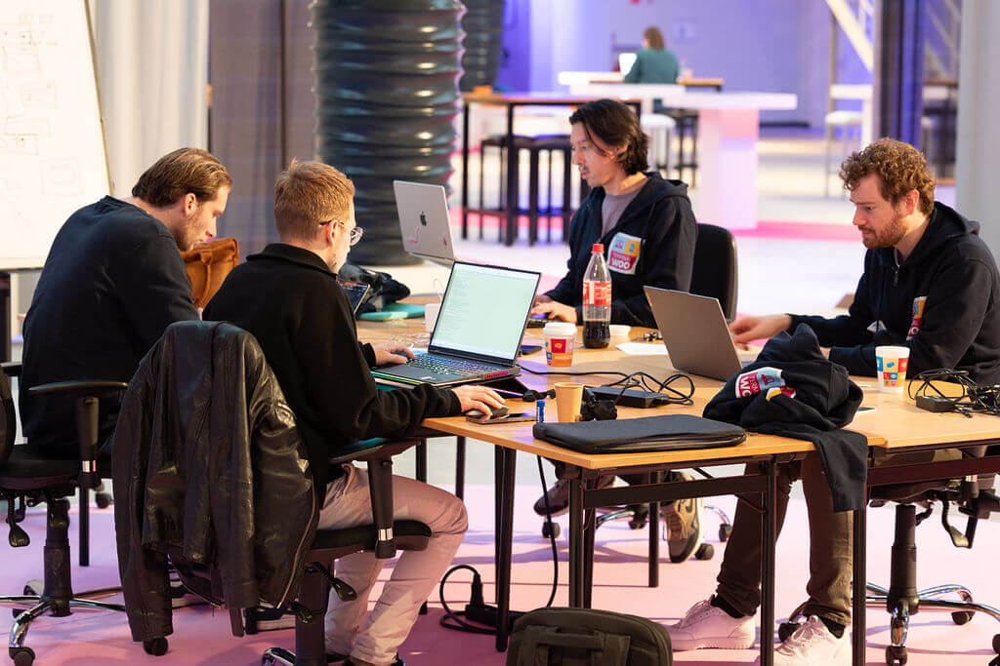
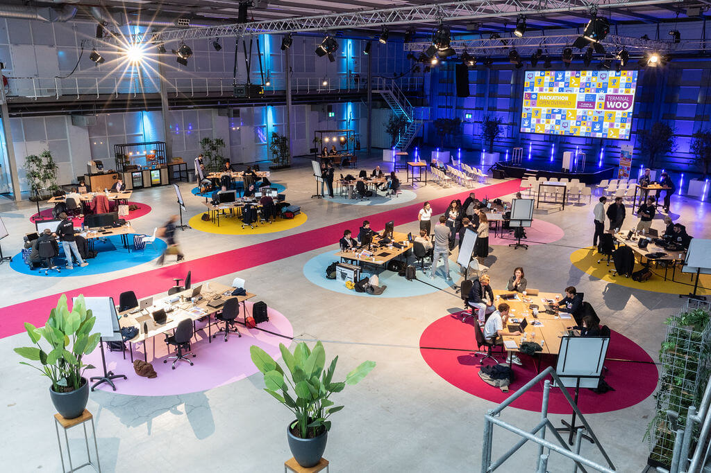

# Participating in a hackaton: Terminal Woo!

(I wrote a much more extensive report on the hackaton on the [website of the OpenGov Lab!](https://www.opengov.nl/blog/2025/11/05/opengov-lab-at-the-hackaton-terminal-woo-zoek-en-verrijk/))

On Friday, October 31st, and Saterday, November 1st, the Ministry of the Interior and Kingdom Relations and the program Open Government (Programma Open Overheid) organised a hackaton to improve the internal process of responding to Woo-requests. David, Damiaan, Jos (PhD student @ Utrecht University) and me represented the OpenGov Lab as one of the ten teams that participated in the event!

The hackaton kicked of with talks from Martijn Aslander and Guido Enthoven. The location was the impressive 'Fokker Terminal' (an old aircraft hangar):

In short (read the full report [here](https://www.opengov.nl/blog/2025/11/05/opengov-lab-at-the-hackaton-terminal-woo-zoek-en-verrijk/)), our tool leveraged the old techniques (we are scientists, after all!) *query extension* and *reference extraction* with a new twist: we used LLMs to find other relevant terms and references to other documents based on a first result set. Hip-hop duo Dr. Jos and MC Maik were selected to give our four-minute pitch on stage to convince the jury of our ideas.

During the pitches, we didn't take home the trophy, but we did manage to stay true to ourselves in applying "old" IR research (query expansion and reference extraction) to a relevant problem! And most of all, we had fun and grew as a team!