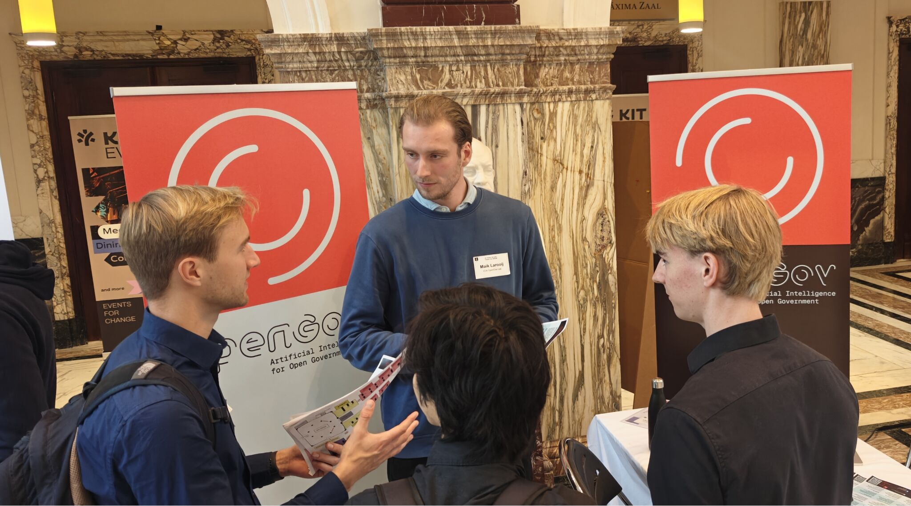

# OpenGov Lab at UvA Thesis Fair

(I wrote a more extensive report on the thesis fair on the [website of the OpenGov Lab!](https://www.opengov.nl/blog/2025/10/27/opengov-lab-at-the-uva-thesis-fair-2025/))

On Friday, October 17th, I was part of the OpenGov Lab delegation that was present at the UvA (AI) Thesis Fair to talk to prospective thesis students! I was there the whole morning to persuade AI Master students into applying for our cool projects. It was very fun to talk to students who were enthousiastic about or lab and projects. There was a particular interest in more politically oriented projects (no surprise with the upcoming elections), like misinformation, party program-parliament consistency and simulating the parliament. 

